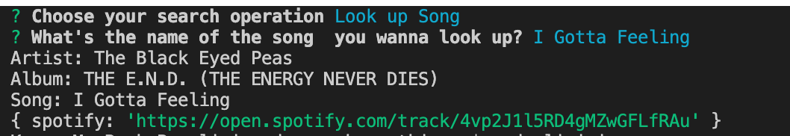

# liri-node-app

---

To start the app, open the liri-node-app's directory in your cancel and enter "node liri.js" into your console (after installing the necessary packages by running npm i)

This is a simple application that allows a user to look up a band, song, movie, or read a file that has commands to complete any of those operations. It also creates a text file of all the user's history of commands.

Then, select the operation you want to use of the four listed. 

You can look up a band's tour dates, a movie's details, song's information, or a file in the local database.

I used inquired, fs, moment, and axios packages, while using Spotify, OMBD, and Bands in town API/datbases.

I wrote the code.

--

The four options:

After selecting, "Look up Concert", and typing "Black Eye Peas"

After selecting, "Look up Song" , and typing "I Gotta Feeling"

After selecting, "Look up Movie" , and typing "True Grit"

After selecting, "Read this File" , and typing "random.txt" (a local text file)

